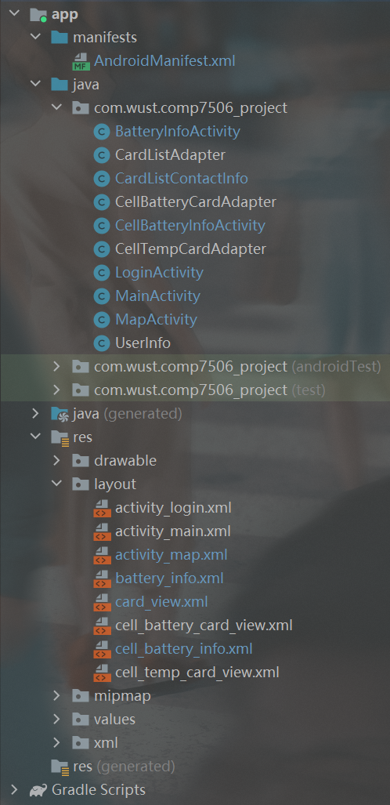

# EV BMS App

## Project Overview

**EV BMS App** is an Android application designed to monitor electric vehicle battery status in real time. It provides users with detailed battery pack information, individual cell data, real-time location tracking, and trajectory history visualization using the Baidu Map SDK.

The application communicates with a remote server via predefined HTTP APIs to retrieve battery-related data.

## Environment Requirements

- **Android Studio** (version Arctic Fox 2020.3.1 or later)
- **Java 8** or above
- **Gradle** (compatible with your Android Studio version)
- **Android device or emulator** (Android 6.0 Marshmallow or above)
- **Baidu Map API Key** (configured in the project)

## Installation and Setup

1. **Clone the Project**  
   Clone or download the project source code from the repository.

2. **Open in Android Studio**  
   Open Android Studio → File → Open → Select the project directory.

3. **Configure Baidu Map API Key**

   - Apply for a [Baidu Map API Key](https://lbsyun.baidu.com/).
   - Open `AndroidManifest.xml`.
   - Replace the placeholder with your actual API Key:
     ```xml
     <meta-data
         android:name="com.baidu.lbsapi.API_KEY"
         android:value="YOUR_API_KEY_HERE" />
     ```

4. **Build the Project**  
   Sync Gradle and build the project (Build → Make Project).

5. **Run the Application**
   - Connect your Android device or start an emulator.
   - Click **Run** or use the shortcut **Shift + F10**.

## API Endpoints

The application fetches data from predefined APIs.

> ⚠️ **Note**: The backend APIs are externally maintained. This application assumes API responses are returned in standard JSON format.

## Project Structure



## Notes

- Make sure your device has an active internet connection to fetch API data and load maps.
- Location permission must be granted to the app for map and tracking features to work properly.
- If the map does not display correctly, verify that the Baidu Map API Key is correctly set and has the necessary service permissions.
